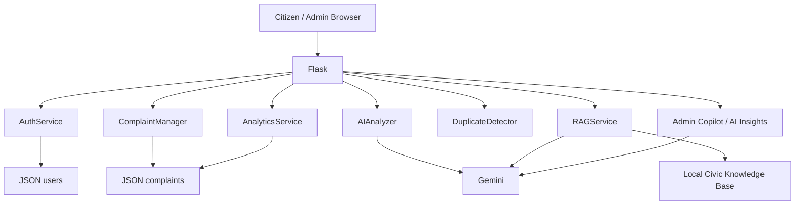

# CivicAI — AI-Powered Smart Civic Complaint System

> **From citizen complaint to AI-powered civic action.**

CivicAI is a lightweight Flask application for the AI Smart Civic Services hackathon. Citizens report local problems; AI classifies and prioritizes them, estimates public risk, recommends a department, improves complaint wording, optionally uses submitted images as AI evidence, and helps administrators make decisions. A small RAG assistant answers civic questions from a controlled local knowledge base.

## AI features

- Gemini complaint classification
- AI priority, summary, reason and confidence
- **AI risk assessment**: risk level, public impact, recommended response time and risk reasoning
- **AI complaint improver**: rewrites unclear citizen descriptions without adding facts
- **Optional Gemini vision** when a supported image is attached to a complaint
- **AI operations insights** from current complaint statistics
- **Admin Copilot** for questions over current complaint records
- Lightweight TF-IDF + keyword RAG with visible sources
- Explainable duplicate complaint detection
- Local fallback when Gemini is unavailable

## Authentication

- Citizen registration and login
- Citizen dashboard with "My Complaints"
- Admin login and protected dashboard
- Passwords stored as secure hashes in JSON
- Sessions use Flask's signed cookie mechanism

Demo accounts after first run:

```text
Citizen: citizen / civic123
Admin:   admin / value of ADMIN_PASSWORD in .env
```

Change the admin password before deployment.

## Architecture



## Project structure

```text
civic_ai/
├── app.py
├── config.py
├── seed.py
├── requirements.txt
├── .env.example
├── .gitignore
├── vercel.json
├── api/
│   └── index.py
├── data/
├── knowledge_base/
├── models/
├── services/
│   ├── ai_service.py
│   ├── auth_service.py
│   ├── rag_service.py
│   ├── complaint_service.py
│   ├── analytics_service.py
│   └── duplicate_service.py
├── utils/
├── templates/
└── static/
```

## Local setup

```bash
python -m venv .venv
```

Windows:

```bash
.venv\Scripts\activate
```

macOS/Linux:

```bash
source .venv/bin/activate
```

Install:

```bash
pip install -r requirements.txt
```

Create `.env` from `.env.example` and set:

```env
GEMINI_API_KEY=your_real_gemini_key
GEMINI_MODEL=gemini-2.5-flash
SECRET_KEY=use-a-long-random-secret
ADMIN_USERNAME=admin
ADMIN_PASSWORD=change-this-password
FLASK_DEBUG=false
```

Seed the demo data:

```bash
python seed.py
```

Run:

```bash
python app.py
```

Open `http://127.0.0.1:5000`.

## Main routes

- `/` landing page
- `/report` complaint submission
- `/track` public complaint tracking
- `/complaint/<id>` complaint details
- `/assistant` RAG CivicAI assistant
- `/login` citizen/admin login
- `/register` citizen registration
- `/dashboard` citizen dashboard
- `/admin/login` administrator login
- `/admin` admin dashboard

## AI demo

Try a complaint such as:

> There is a large water leak near the main road and traffic is becoming difficult.

CivicAI should return structured information including category, priority, department, summary, risk level, public impact and recommended response time.

Try the complaint improver with a short input such as:

> road bad near school

The user must review the result before submitting.

## RAG demo

Ask:

> Which department handles a major water leakage?

The assistant retrieves relevant Markdown knowledge and displays the sources used.

## Admin AI demo

From the dashboard:

- Generate AI Operations Insight
- Ask Admin Copilot: `Which department has the most critical complaints?`
- Ask: `Show me critical complaints that are still open.`

The copilot is grounded only in the current complaint records.

## Vercel deployment

This repository includes:

```text
api/index.py
vercel.json
```

1. Push the project to GitHub.
2. Import the repository into Vercel.
3. Add environment variables in Vercel Project Settings:

```text
GEMINI_API_KEY
GEMINI_MODEL
SECRET_KEY
ADMIN_USERNAME
ADMIN_PASSWORD
FLASK_DEBUG=false
```

4. Deploy.

The Vercel entry point imports `app` from `app.py`.

### Important JSON limitation on Vercel

The hackathon intentionally uses JSON instead of SQL. Vercel serverless functions do not provide durable application-file writes. CivicAI detects Vercel and copies the packaged JSON files into `/tmp/civicai_data` so the demo can run and write during a warm function instance. Those changes are **ephemeral** and can disappear when the instance is replaced.

Therefore:

- The deployed demo is suitable for demonstrating the product.
- It is **not production-grade persistent storage**.
- For a real civic service, replace `JSONDatabase` with a persistent storage service.

Uploaded images on Vercel are also temporary. The app still supports image AI during the request, but permanent media storage is not claimed.

## Security

- API keys are environment variables only.
- `.env` is ignored by Git.
- Uploaded image types are restricted.
- Upload size is limited.
- Filenames are sanitized.
- Admin routes require authentication.
- Passwords are hashed.
- AI errors are handled without exposing stack traces.

## Responsible AI

AI is decision support, not an autonomous authority.

- AI predictions can be wrong.
- Confidence is not certainty.
- Risk is an estimate based on submitted evidence.
- RAG answers are limited to the supplied knowledge base.
- Human administrators make final routing and priority decisions.
- Image analysis can miss important visual details.

## Hackathon demo flow

1. Register/login as citizen.
2. Report a water leak.
3. Use **Improve with AI**.
4. Submit the complaint with an optional image.
5. Show category, priority, department and AI risk assessment.
6. Track the complaint.
7. Sign in as admin.
8. Filter critical complaints.
9. Generate AI Operations Insight.
10. Ask Admin Copilot a question.
11. Demonstrate duplicate detection.
12. Ask CivicAI a RAG question and show sources.
13. Explain the Vercel JSON persistence limitation and responsible-AI safeguards.


## Premium product UI

The landing page has been upgraded with an industry-style civic operations presentation:
- citizen-first messaging and clear calls to action
- AI triage / route / act workflow
- operational impact metrics
- civic issue photo cards
- responsible-AI messaging
- responsive mobile layout
- accessible, high-contrast controls

The photo cards use optimized Unsplash image URLs for the visual demo. If your deployment environment blocks third-party images, the application still works; replace those URLs with locally licensed images under `static/images/`.


## CivicAI Chat Providers

The CivicAI assistant uses a provider fallback chain so the demo remains usable:

1. **Gemini** — primary provider when `GEMINI_API_KEY` is configured.
2. **Qwen via Hugging Face** — automatic fallback when `HF_TOKEN` is configured.
3. **Local knowledge fallback** — returns the most relevant knowledge-base statement when both AI providers are unavailable.

Add these environment variables to `.env` locally or to Vercel Environment Variables:

```env
GEMINI_API_KEY=your_gemini_key
GEMINI_MODEL=gemini-2.5-flash
HF_TOKEN=your_huggingface_token
HF_MODEL=Qwen/Qwen2.5-7B-Instruct
HF_CHAT_URL=https://router.huggingface.co/v1/chat/completions
```

Hugging Face model/provider availability and free inference limits can change. If the selected Qwen model is not available for your account, choose a Qwen instruction/chat model currently available in Hugging Face Inference Providers and change only `HF_MODEL`.

Never commit `.env` or API tokens to GitHub.
